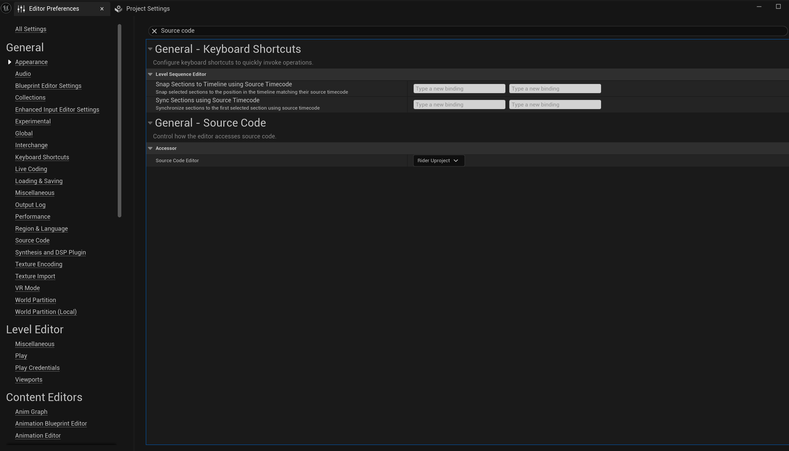
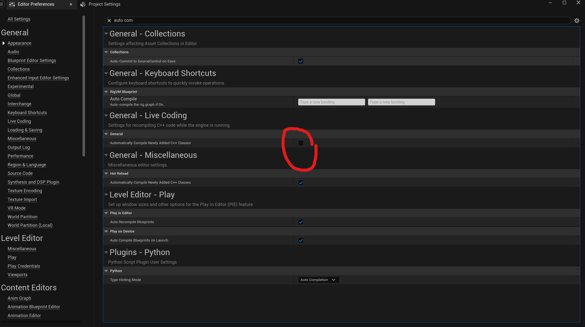
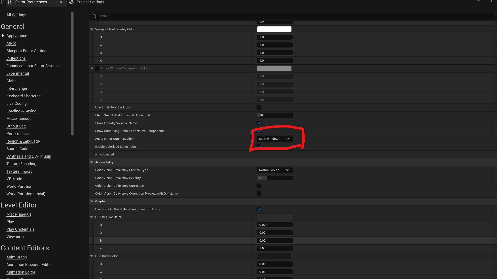

#### 项目设置



#### 代码提交规范
结构：
```
<类型>[可选范围]: <描述>
[空行]
<正文>
[空行]
<尾部>
```
1. 标题（必填）

格式：`<type>(<scope>): <description>`
示例：`feat(login): 新增用户登录功能`
字段说明：

类型（type）：使用明确动词，推荐类型：

- feat：新功能
- fix：修复问题
- docs：文档变更
- style：代码样式调整（不影响功能）
- refactor：代码重构
- test：测试相关
- chore：构建工具或辅助脚本变更


范围（scope）：可选，用括号包裹，如模块名 user 或文件名 api.js。

描述（description）：简明扼要（≤50字符），以动词开头，如 修复登录超时问题。

2. 正文（可选）
内容：详细说明变更背景、原因和结果，每行≤72字符。

3. 尾部（可选）
关联问题：使用 Closes #123 或 Fixes #456 关联缺陷或需求。
破坏性变更：若引入不兼容改动，需以 BREAKING CHANGE: 开头说明。